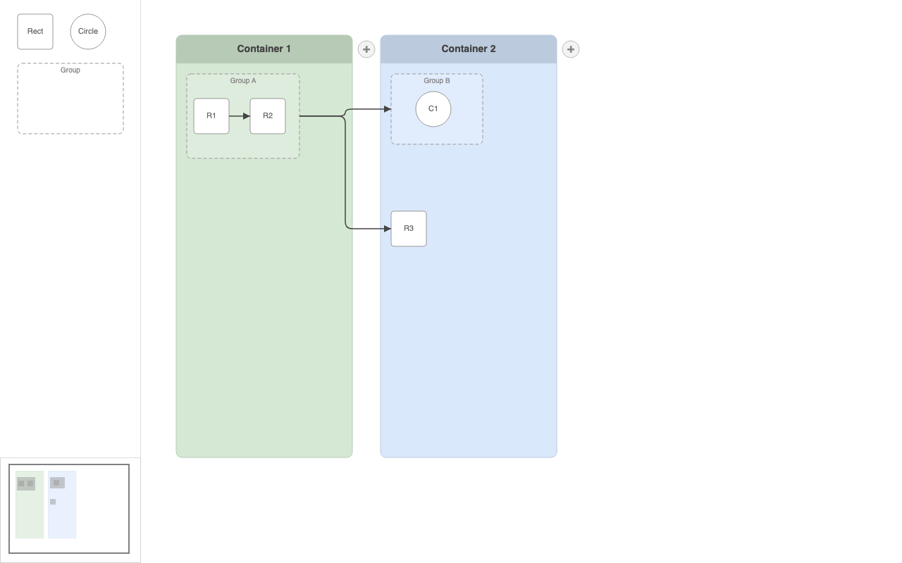

# JointJS+: Container Editor 

Container Editor is a JointJS+ demo application that allows you to organize elements into containers and groups, with links that intelligently route between groups.

This demo is also available online at [jointjs.com](https://jointjs.com/demos/container-editor).

## Available Versions

- [TypeScript](./ts/)

## Screenshot

