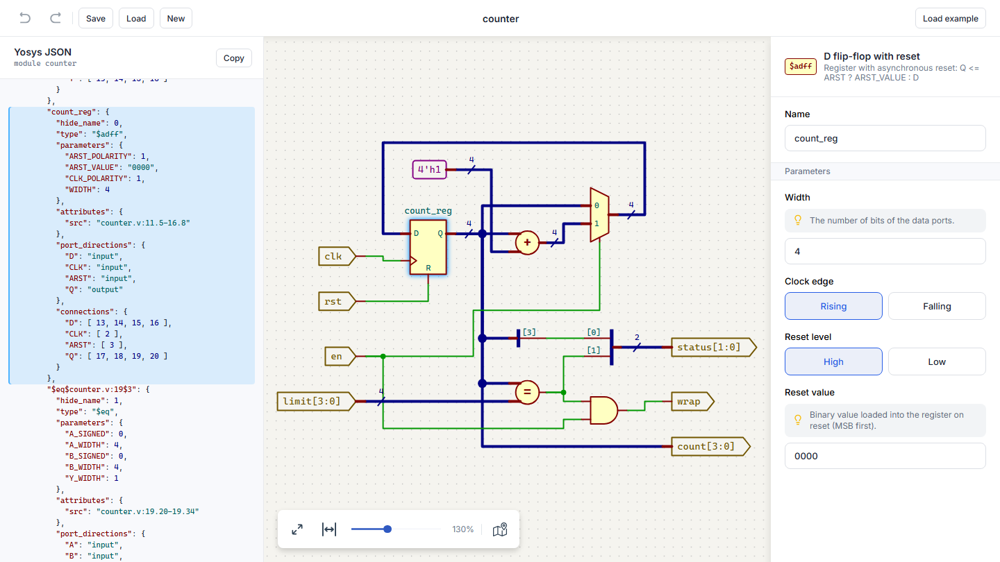

# JointJS+: HDL Schematic Editor 

The HDL Schematic Editor demo app lets you view and edit a digital circuit netlist in the [Yosys](https://yosyshq.net/yosys/) JSON format as a schematic diagram. The diagram is laid out automatically with [ELK](https://eclipse.dev/elk/) (`@joint/layout-elk`) and the Yosys JSON is updated live as you edit the circuit.

## Available Versions

- [TypeScript](./ts/)

## Screenshot

